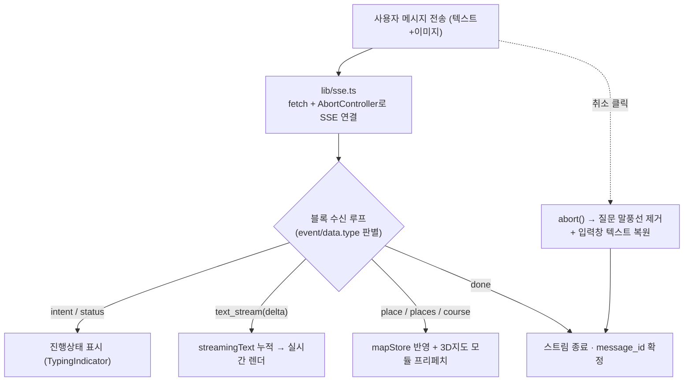
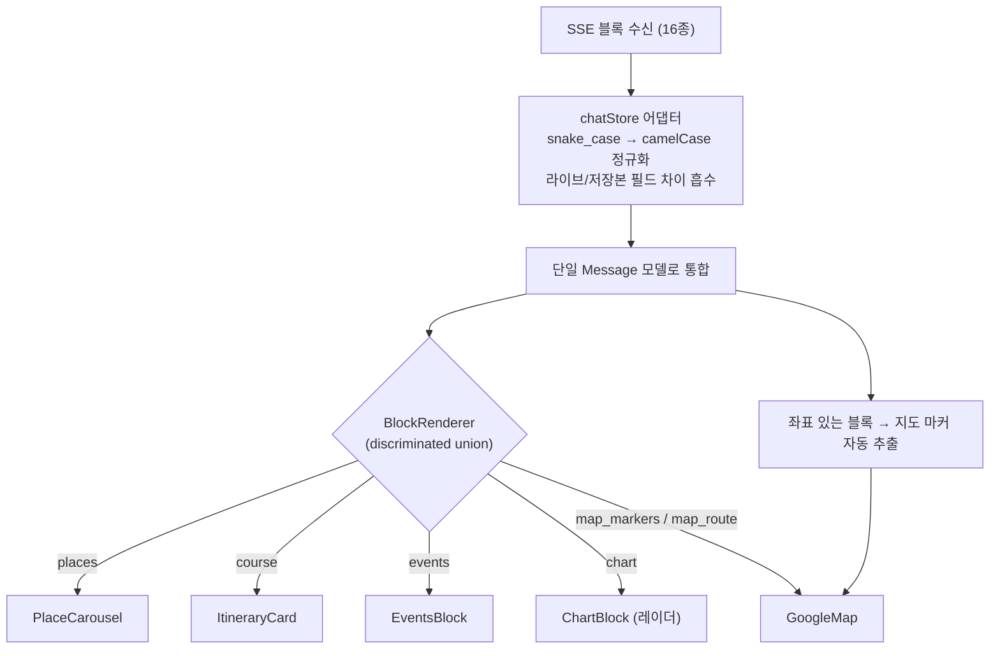
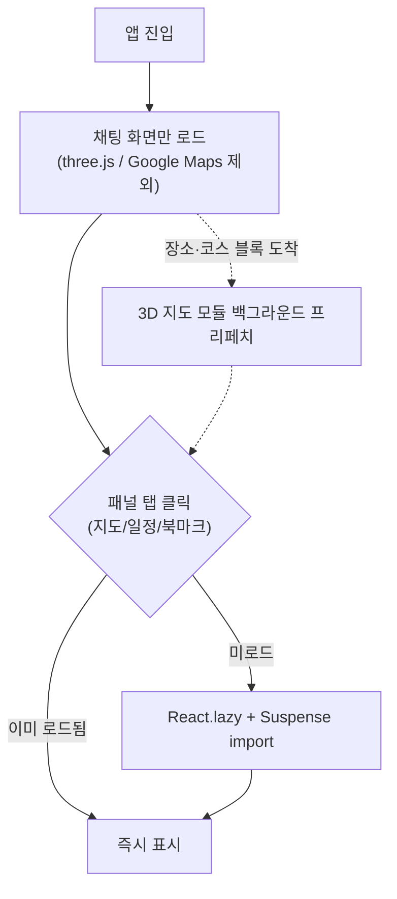
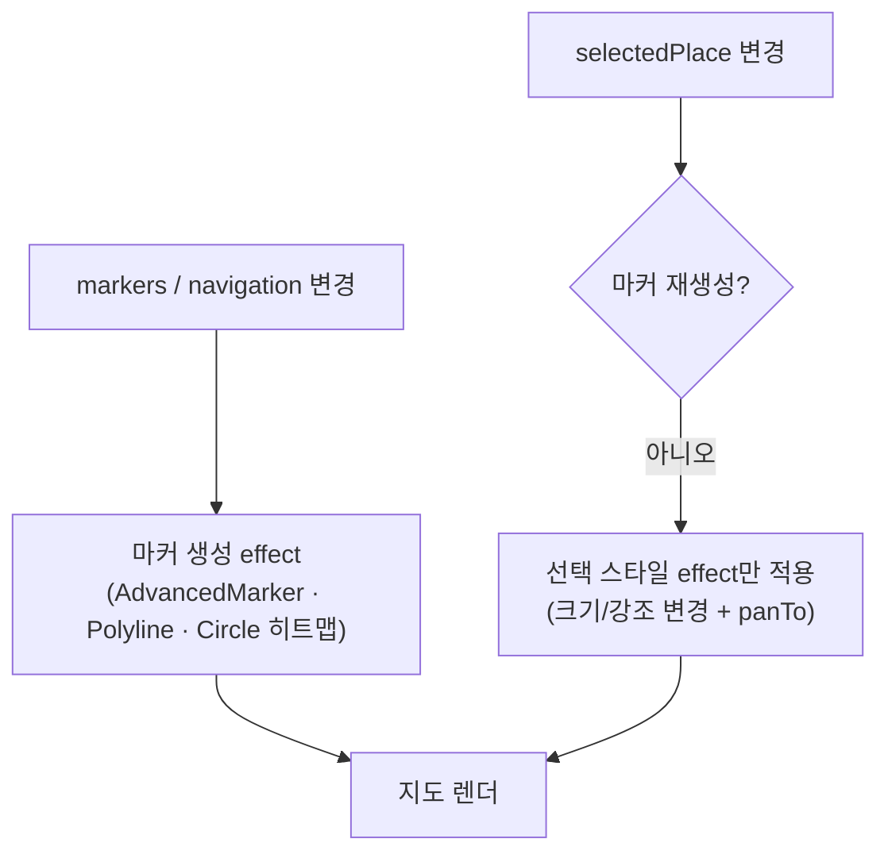
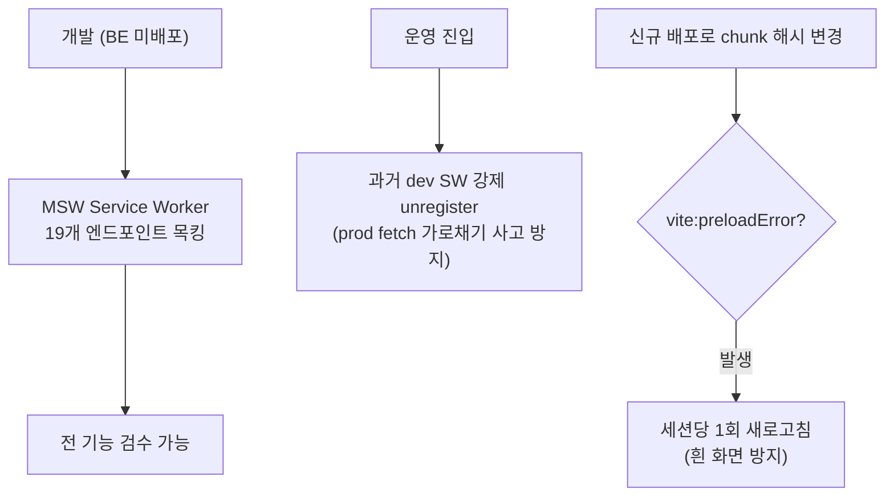

# Anyway (agt) — 기술 포트폴리오

> 서울 관광 AI 에이전트 웹서비스. 자연어 입력을 멀티 에이전트로 라우팅해 장소·코스·이벤트를 실시간 스트리밍으로 제공하고, Google Maps 위에 마커·경로로 시각화한다.

**Tech Stack**
React 19.2 · TypeScript 5 · Vite 6 · Zustand 5 (9 stores) · React Router 7 · Tailwind CSS 4 · @googlemaps/js-api-loader 2 (AdvancedMarker / Polyline / OverlayView / Photorealistic 3D) · GSAP 3 · MSW 2 · openapi-typescript 7 · Vitest 3

> 각 케이스는 **요구사항 → 해결과정 → 결과** 구조이며, 좌측 플로우차트(Mermaid)는 의사결정/데이터 흐름을 나타낸다. 실측이 필요한 수치는 `[측정 필요]`로 표기했다.

---

## ① 실시간 SSE 스트리밍 파이프라인 — 네이티브 EventSource를 fetch+AbortController로 대체해 "재연결 루프"와 "취소 불가" 문제를 해결

**요구사항**
- LLM 응답은 토큰 단위로 점진 도착해야 하므로 실시간 스트리밍이 필수
- 네이티브 `EventSource`는 스트림 단절 시 비멱등 GET을 자동 재연결 → LLM 응답이 처음부터 재실행되는 루프 발생
- 응답 "준비 단계"에서도 사용자가 확실하게 취소할 수 있어야 함

**해결과정**
- `fetch` + `AbortController` 기반 커스텀 SSE 파서(`lib/sse.ts`)로 `EventSource` 대체 — 자동 재연결을 제거해 재실행 루프 차단
- 프레임 버퍼링 · heartbeat 무시 · `event` 필드와 `data.type` 폴백 판별을 직접 구현
- 취소 시 `AbortController.abort()` → 진행 중 스트림 중단 + 질문 말풍선 제거 + 입력 텍스트 복원

**결과**
- 스트림 단절·취소 시 LLM 재실행 루프 제거
- 준비 단계 포함 어느 시점에서도 취소 버튼이 확정적으로 동작
- 토큰 누적 렌더로 즉각적인 응답 체감

---

## ② 16종 SSE 블록 → 통합 메시지 어댑터 & 블록 렌더링 시스템 — 이종(異種) 스트림 데이터를 단일 모델로 정규화

**요구사항**
- BE가 한 응답 안에서 16종(text_stream, places, course, chart, map_route, calendar …)의 이종 블록을 스트리밍
- 라이브 SSE(`delta`)와 DB 저장본(`content`)의 필드 형태가 다르고, snake/camel 케이스가 혼재
- 좌표를 가진 블록은 지도 마커로도 동시에 표현 필요

**해결과정**
- 16종 블록을 단일 `Message` 모델로 변환하는 어댑터 계층(`chatStore.ts`)을 설계 — 정규화·필드 차이 흡수를 단일 지점에 집중
- `type` 기반 discriminated-union `BlockRenderer`(`blocks/index.tsx`)로 블록별 컴포넌트 디스패치
- 좌표 보유 블록에서 마커를 자동 추출해 `mapStore`로 전달 (MCP raw 데이터를 UI에 직접 넘기지 않는 단방향 흐름)

**결과**
- BE 블록 스키마 변경 시 어댑터 한 곳만 수정 → 변경 격리
- 채팅·지도 양쪽이 동일 데이터에서 일관되게 렌더
- `openapi-typescript` 자동 생성 타입(1,470줄)과 결합해 FE/BE 계약 동기화

---

## ③ 초기 번들 최적화 — 코드 스플리팅·지연 로딩·투기적 프리페치로 "필요할 때만, 미리" 로드

**요구사항**
- Lottie·GSAP·Google Maps·three.js 등 무거운 의존성이 초기 진입 번들을 키움
- 채팅만 쓰는 사용자가 지도/3D 엔진까지 내려받을 필요는 없음
- 앱 코드만 바뀌어도 vendor까지 다시 받으면 재방문이 느려짐

**해결과정**
- Vite `manualChunks`로 vendor 분리(`vendor-react / gsap / lottie / google-maps`) → Lottie 317KB·GSAP 71KB를 메인 번들에서 격리
- 지도·일정·북마크 패널과 5개 라우트를 `React.lazy` + `Suspense`로 분할 (MapPanel 28KB·Google3DMap이 첫 진입 번들에서 제외)
- 장소·코스 블록이 도착하면 3D 지도 모듈을 **미리** 프리페치 → 지도 탭 클릭 시 대기 단축
- 커스텀 `asyncCssPlugin`으로 render-blocking CSS를 `preload`+swap 처리 (`<noscript>` 폴백)

**결과**
- 첫 진입 시 채팅 화면이 three.js/Google Maps를 끌어오지 않음
- 앱 코드 변경 시 vendor chunk는 캐시 재사용 → 재방문 파싱·평가 단축
- 초기 JS 감소율 / LCP 단축폭 `[측정 필요]` (Lighthouse 전후 비교 권장)

---

## ④ 명령형 Google Maps 레이어 — 마커 라이프사이클을 분리해 불필요한 재생성을 제거

**요구사항**
- 추천 장소·코스를 마커/경로로 시각화하고, 카드 클릭 시 해당 마커를 강조
- 선택이 바뀔 때마다 전체 마커를 재생성하면 깜빡임·비용 발생

**해결과정**
- `@googlemaps/js-api-loader`로 AdvancedMarker·Polyline·다층 Circle 히트맵·OverlayView를 직접 제어(`GoogleMap.tsx`)
- **마커 생성 effect와 선택-스타일 effect를 분리** → 선택 변경 시 마커를 재생성하지 않고 스타일/`panTo`만 갱신
- 카드→마커 FLIP 전환(`flip-to-marker.ts`)을 GPU transform + `prefers-reduced-motion` 가드로 구현

**결과**
- 선택 변경 시 마커 재생성 제거 → 깜빡임 없는 부드러운 강조
- 데스크톱/모바일 동일하게 선택 마커 강조 + 중심 이동

---

## ⑤ 협업·배포 내성 — MSW 계약 목킹과 stale-chunk 가드

**요구사항**
- BE 미배포 상태에서도 FE 전 기능을 검수해야 함
- 과거 dev 방문으로 남은 Service Worker가 운영 fetch를 가로채면 사고
- 신규 배포 후 캐시된 페이지가 옛 chunk를 요청하면 흰 화면 발생

**해결과정**
- MSW로 19개 엔드포인트(611줄)를 목킹해 BE 비의존 개발 파이프라인 구성
- 운영 진입 시점에 stale Service Worker를 강제 unregister
- `vite:preloadError`를 잡아 세션당 1회만 새로고침하는 가드(`main.tsx`)
- delete/rename은 낙관적 업데이트 + 실패 롤백

**결과**
- BE 일정과 독립적으로 FE 개발/검수 진행
- 배포 후 흰 화면·stale SW 사고 방지

---

## 부록 — 이력서 키워드 뱅크

**성능/최적화**: 코드 스플리팅(manualChunks) · 라우트/패널 지연 로딩(React.lazy+Suspense) · render-blocking CSS 제거(asyncCssPlugin) · 폰트 self-host + unicode-range subset · immutable 장기 캐시 · 투기적 프리페치 · 메모이제이션(useCallback 38/useMemo 12/memo 15) · GPU transform FLIP

**아키텍처/파이프라인**: 커스텀 SSE 스트리밍 파이프라인 · 16종 블록→메시지 어댑터 · discriminated-union 블록 렌더러 · OpenAPI 타입 자동 생성 · 단방향 Zustand 9 스토어 · tsc→lint→build CI 게이트

**프론트엔드**: 명령형 Google Maps 통합 · 마커 라이프사이클 분리 · 견고한 fetch 래퍼(AbortSignal.timeout/any·401·422 한글화) · 낙관적 업데이트+롤백 · 4상태 UI · 배포 내성(stale-chunk)

**AI/실시간**: 실시간 토큰 스트리밍 · 멀티 에이전트 라우팅 UI · 취소 가능 스트림 + 드래프트 복원

**협업/품질**: MSW 계약 기반 목킹(19 엔드포인트) · 접근성/reduced-motion · Vitest 단위 테스트

### 검증된 정량치 (그대로 사용 가능)
빌드 청크 index 303KB(gzip 96KB)·vendor-lottie 317KB·vendor-gsap 71KB·vendor-react 50KB·MapPanel 28KB / SSE 블록 16종 / MSW 19 엔드포인트 / 자동생성 타입 1,470줄 / Zustand 9 스토어 / useCallback 38·memo 15

### [측정 필요] — 코드만으로 확정 불가
LCP/INP/CLS 개선폭 · 초기 JS 감소율 · 리렌더 감소율 → Lighthouse 전후 측정 시 가장 강력한 근거가 됨.
