# 기술 어필 — 시퀀스/플로우/아키텍처 다이어그램

`portfolio-tech-highlights.md` 의 핵심 작업을 시각화. Mermaid 로 GitHub/Vercel docs renderer 에서 그대로 렌더링됨.

---

## 1. 빌딩 캐시 인프라 — 5단계 우선순위

좌표 → 자치구 매핑 → IndexedDB → Overpass 의 fallback chain.

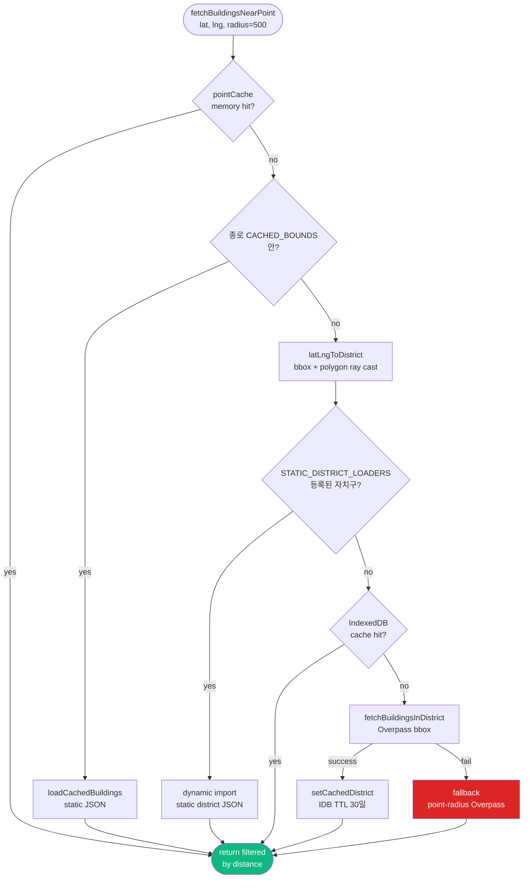

---

## 2. Three.js chunked async + cancel token

빌딩 1만 개 빌드 시 메인 스레드 양보 + 직전 빌드 즉시 abort.

```mermaid
sequenceDiagram
    participant React
    participant Scene as MapScene3D
    participant Loop as Event Loop

    React->>Scene: loadBuildings(buildings, center)
    Scene->>Scene: ++buildGeneration = 7
    Scene->>Scene: clearBuildings()

    loop chunk 200개씩
        Scene->>Scene: ExtrudeGeometry × 200
        Scene->>Loop: await setTimeout(0)
        Loop->>Loop: 다른 작업 처리 (UI, paint)
        Loop-->>Scene: resume
        Scene->>Scene: generation === 7 체크
        Note over Scene: cancel 됐으면 즉시 return
    end

    Scene->>Scene: mergeGeometries by color bucket
    Scene->>Scene: animateBuildings()

    Note over React,Scene: 도중 새 호출 시 ++gen 으로 이전 빌드 자동 abort
```

---

## 3. Marker InstancedMesh batching

마커 N개 → mesh 3개 (sphere/pole/ring InstancedMesh).

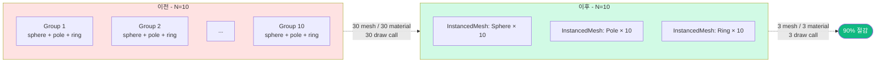

---

## 4. FLIP cross-component — 카드 → 지도 마커

채팅 PlaceCard 클릭 → 카드 클론이 지도 마커 위치로 축소·이동.

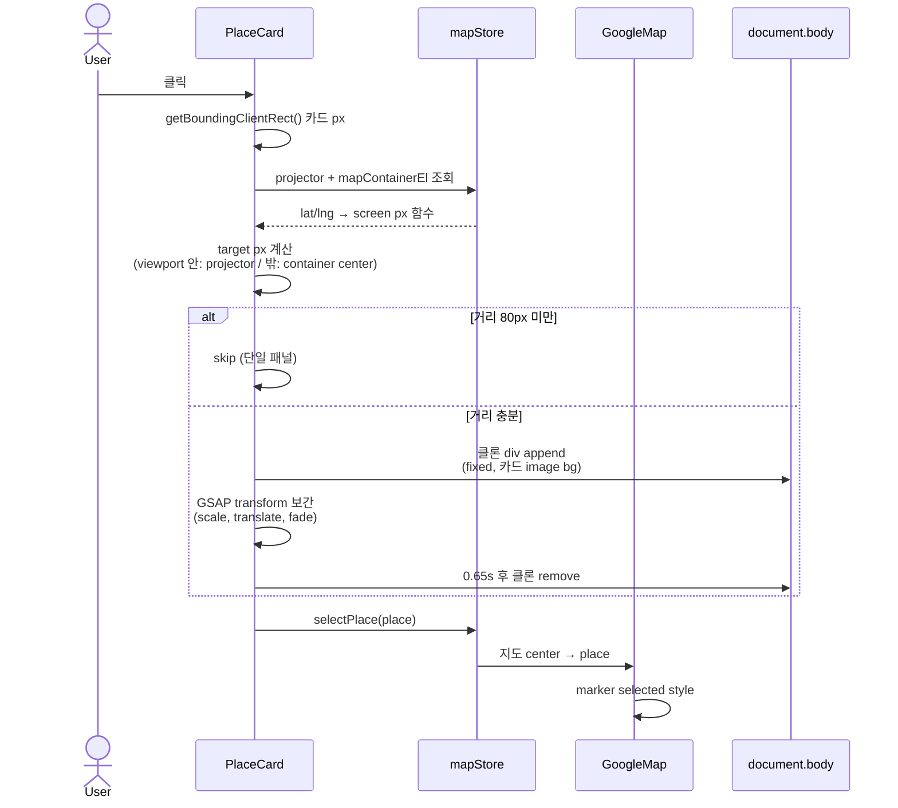

---

## 5. GSAP-React transform 충돌 → 해결 패턴

React inline style 과 GSAP 가 transform 소유권 경쟁.

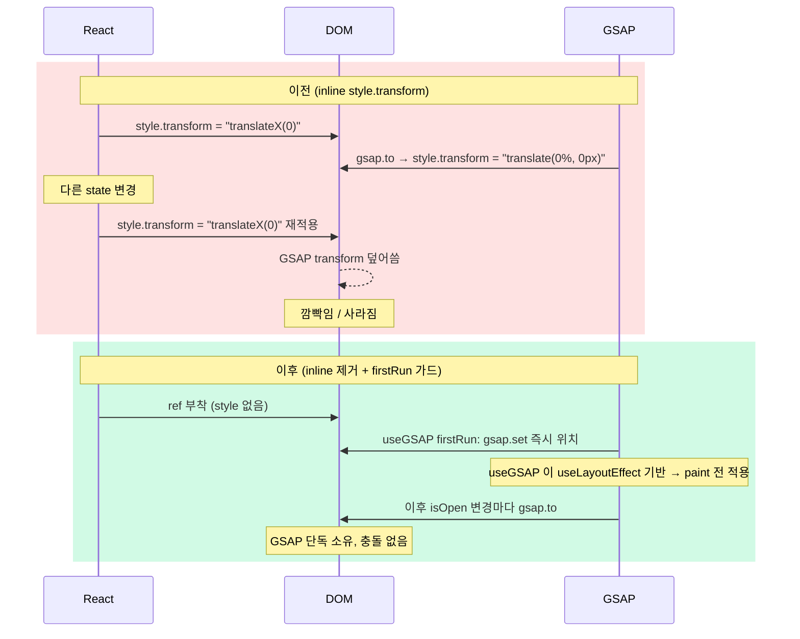

---

## 6. OSM 타일 Cache API + ImageBitmap

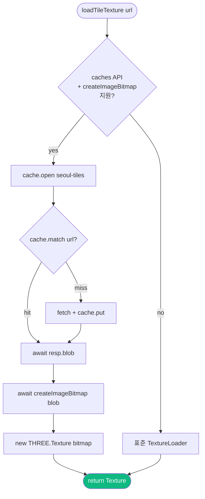

블롭 URL 라이프사이클 회피: ImageBitmap 이 픽셀 데이터 자체 보유.

---

## 7. SSE 다종 이벤트 통합 (chatStore.send)

16종 이벤트가 한 곳에서 통합 처리되며 상태 자동 전이.

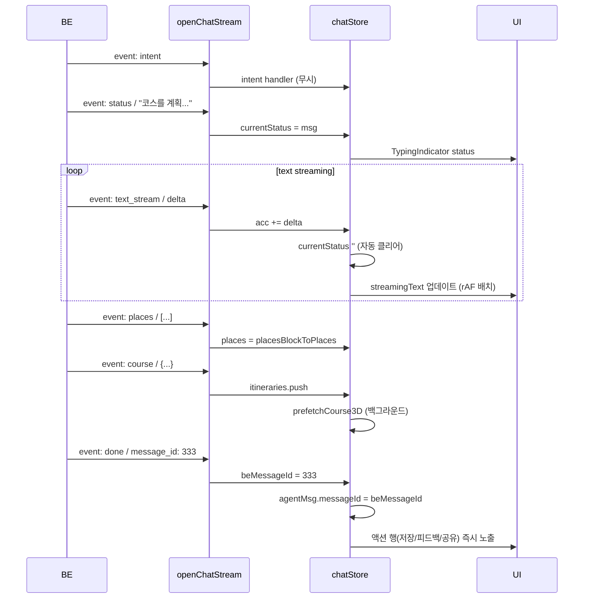

---

## 8. Optimistic + BE sync + rollback

장소 북마크 toggle 의 fire-and-forget 패턴.

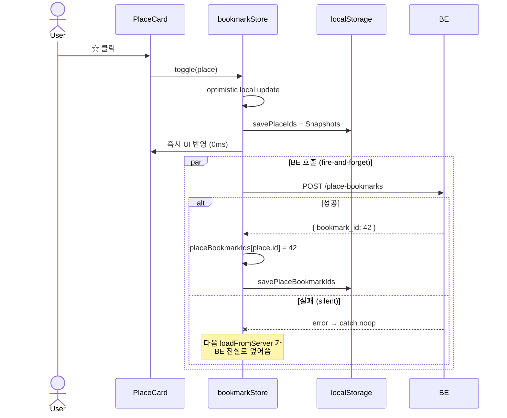

---

## 9. CSS2DRenderer — WebGL 위 DOM 라벨

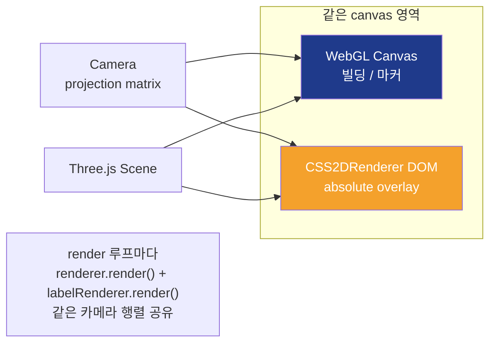

CSS2DObject 의 position 은 3D world coords. Three.js 가 자동으로 카메라 projection 후 DOM transform 적용.

---

## 10. 환경별 라우팅 — Vercel 4.5MB 우회

```mermaid
flowchart LR
    subgraph FE[FE - Vercel 배포]
        Store[zustand store]
        Other[기타 API 호출]
        Upload[uploadApi.image]
    end

    subgraph Edge[Vercel Edge]
        Rewrite[rewrite /api/* → BE]
        Limit{Body 4.5MB?}
    end

    BE[BE GCE<br/>34.50.44.75.nip.io]

    Other -->|relative URL<br/>"/api/..."| Rewrite
    Rewrite -->|<= 4.5MB| Limit
    Limit -- pass --> BE
    Limit -- exceed --> Reject[❌ 413]

    Upload -->|env-aware 절대 URL<br/>https://34.50.44.75.nip.io| BE
    Note[직접 호출 → 4.5MB 한계 우회<br/>BE CORS 가 vercel.app 허용]

    style Reject fill:#DC2626,color:#fff
    style BE fill:#10B981,color:#fff
```

`UPLOAD_BASE = import.meta.env.DEV ? '' : 'https://34.50.44.75.nip.io'` — dev 는 vite proxy 유지, prod 만 직접 호출.

---

## 11. MSW Service Worker 잔존 — 진단 + 자동 정리

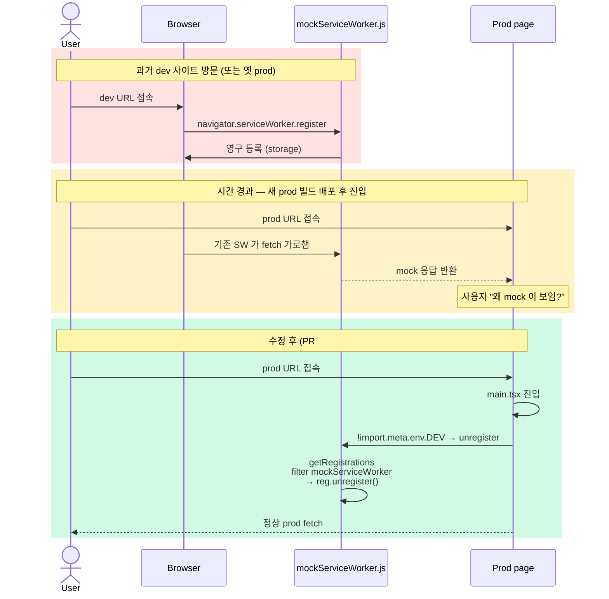

---

## 12. 단일 결정점 helper — 카테고리 일관성

```mermaid
flowchart TB
    subgraph Before[이전 - 3 경로 각자 다른 우선순위]
        B1[ItineraryCard<br/>채팅] -->|mock places.json 만| Mock1
        B2[ItineraryStopsList<br/>지도] -->|stop.category ?? tourism| Mock2
        B3[getPlacesForItinerary<br/>마커] -->|mock 우선 → stop.category| Mock3
        Mock1[다른 결과] -.시각 불일치.- Mock2
        Mock2 -.시각 불일치.- Mock3
    end

    subgraph After[이후 - 단일 helper]
        A1[ItineraryCard]
        A2[ItineraryStopsList]
        A3[getPlacesForItinerary]
        H[(deriveStopCategory)<br/>1 stop.category<br/>2 mock fallback<br/>3 'tourism']
        A1 --> H
        A2 --> H
        A3 --> H
        H --> Same[같은 결과]
    end

    style Mock1 fill:#FEE2E2
    style Mock2 fill:#FEE2E2
    style Mock3 fill:#FEE2E2
    style Same fill:#D1FAE5
    style H fill:#10B981,color:#fff
```

---

## 13. Bundle 분할 + lazy 그래프

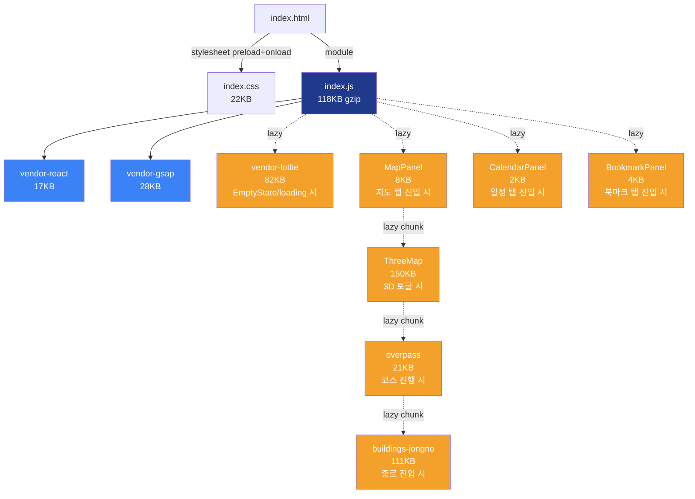

초기 critical path: `index.html → index.css + index.js + vendor-react + vendor-gsap ≈ 163KB gzip`. 나머지는 사용자 액션 시점에 fetch.

---

## 14. CSS 비차단 로딩 + IntersectionObserver

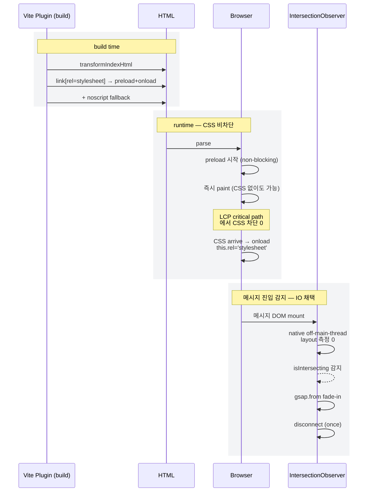

이전 ScrollTrigger 가 메시지 N개 layout 측정 → forced reflow 35ms. IO 로 0.

---

## 종합 — 데이터 흐름 마스터 다이어그램

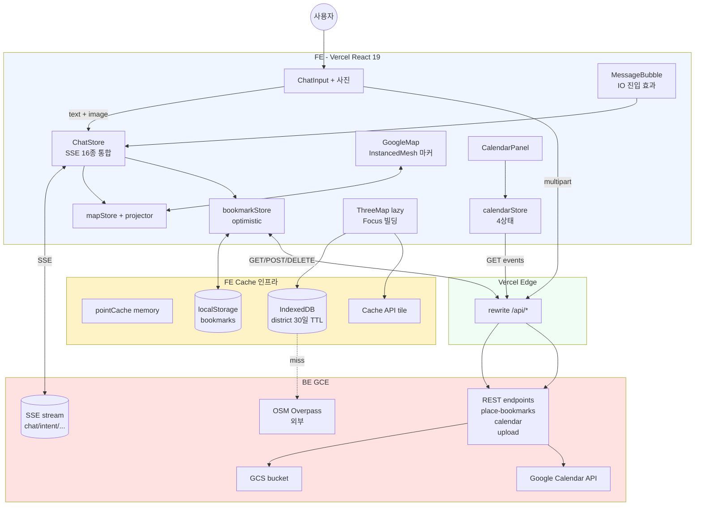

이 다이어그램이 시스템 전체 데이터 흐름의 single source. 면접/리뷰 시 한 장으로 설명 가능.
